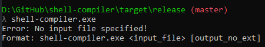

# Shell Compiler 🖥️

*This is a little project created as a joke after all.*

## Origins of the joke
On a discord server, one day, someone asks why his shell script doesn't compile. \
This leads me to do this, a stupid program in Rust which wraps each script line in a system call.

## Limitations
Obviously, this is not a magic thing. It has some limitations, for example it doesn't support scripts containing:
- conditions, loops, etc. (`goto`, `for`, `if`, etc. are not supported)
- heredocs (for now at least) and stuff like this
- variables

etc.

If you compile a script like this and then execute it, **you may harm your system**.
This is not to say that you can't harm your system by using this software correctly. You don't have any warranty. 
Please be sure to understand what you are compiling before to do so. 

This is an experimental thing, not a production ready one. **Use it at your own risks.**

## How to use it?
### Prerequisites
To use this program, you need:
- GNU C Compiler (GCC)

That's pretty much it.

### Syntax
The format is the following: `shell-compiler <input file> [output file without extension]`.

## How to compile it?
### Prerequisites
To compile it, you'll need to have:
- A Rust toolchain installed on your system
- Cargo 

*Don't worry: a Rust toolchain, cargo and more are included in a default installation using rustup*

That's pretty much it too.

### Compiling
To compile it, simply go to the root directory and run `cargo build --release`.
